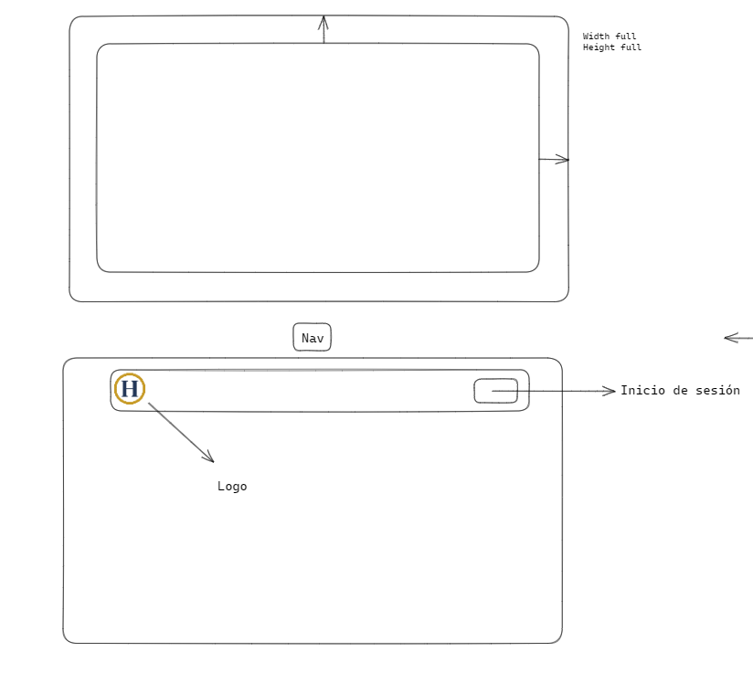
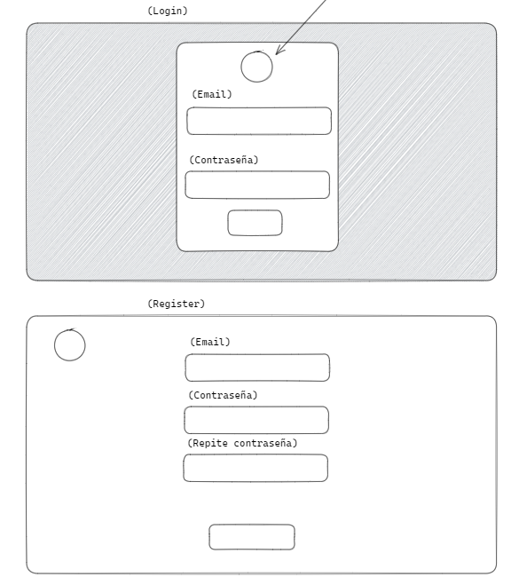
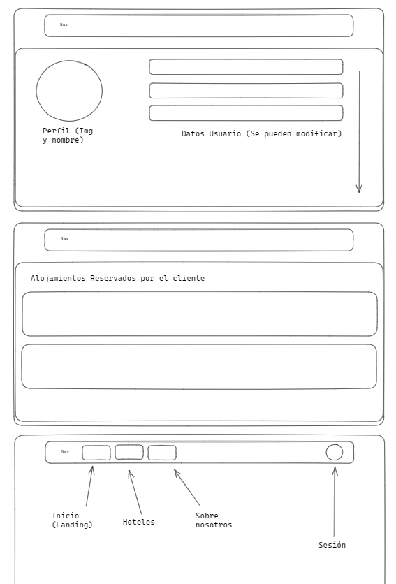
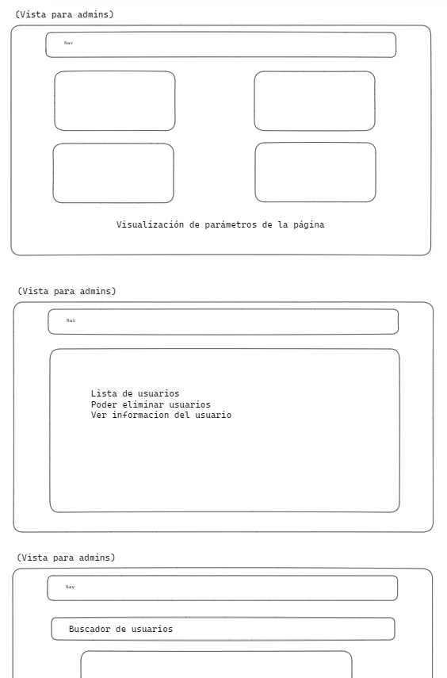
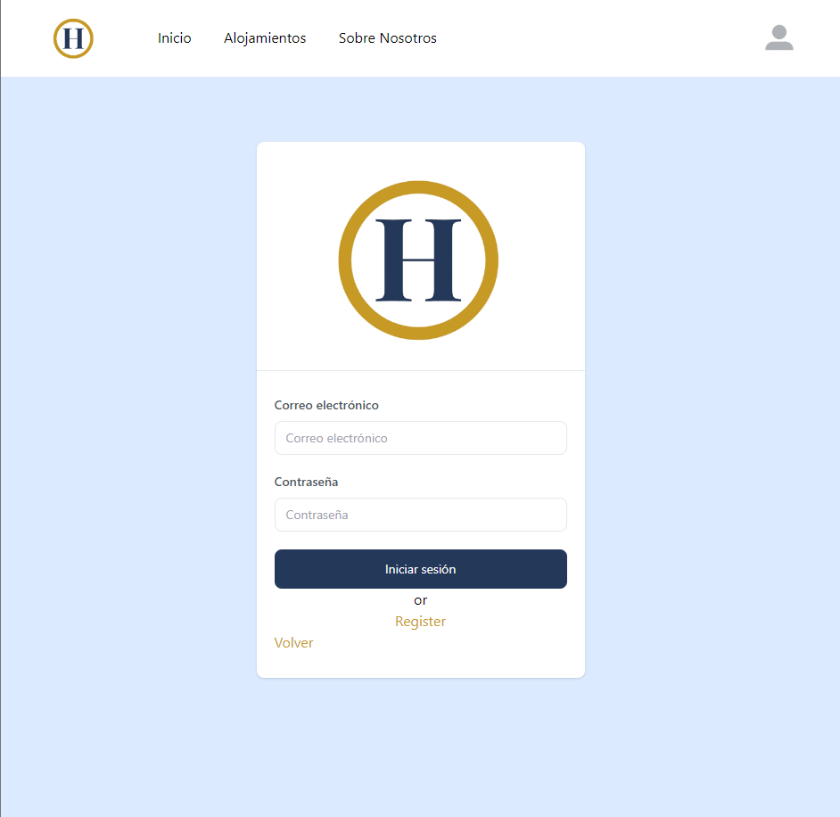
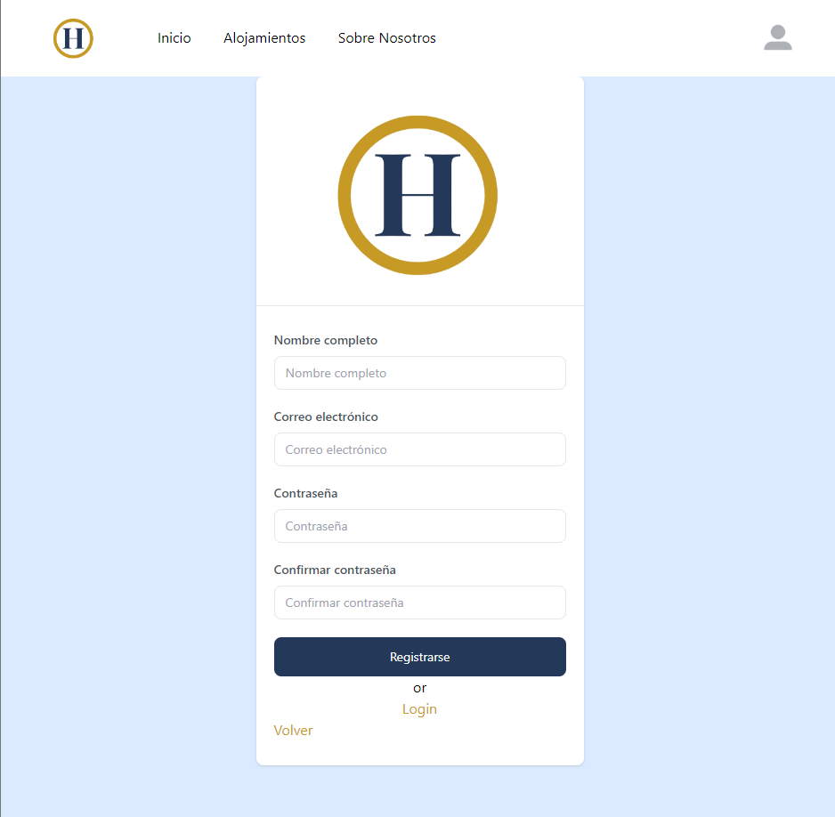
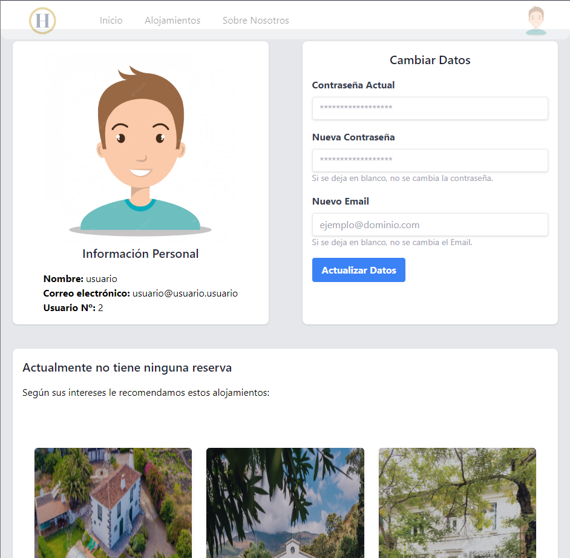
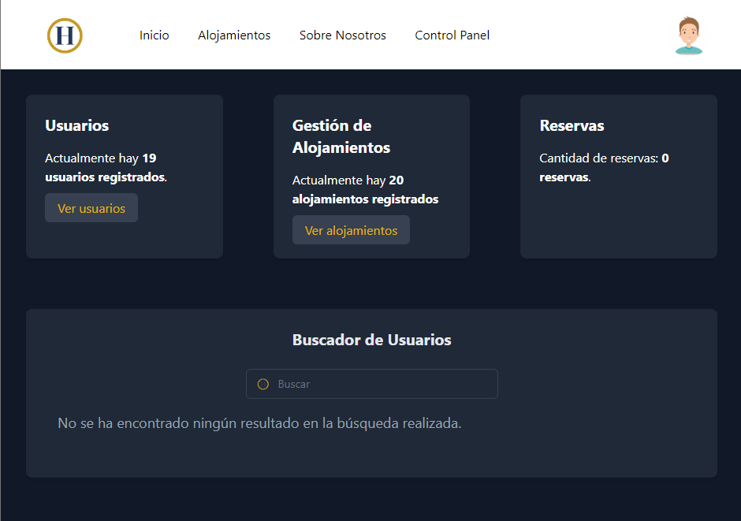
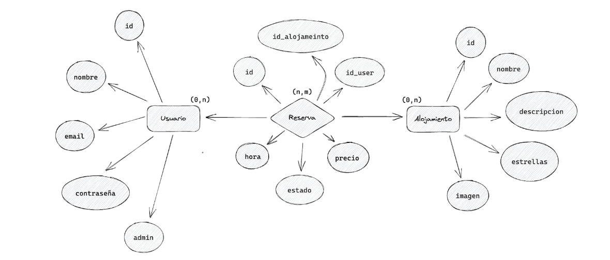
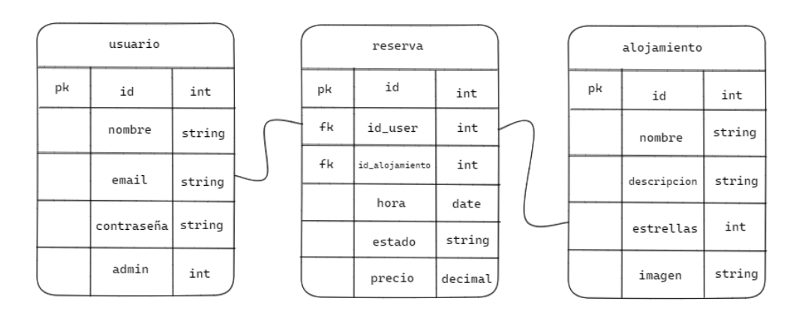

## HOWEB

## About HOWEB

Howeb is an accommodation booking application that offers various options for different types of users. Each user has access to specific functionalities that are tailored to their needs.

Among the functionalities offered by Howeb are the possibility to book accommodations in different destinations and to see a wide selection of available accommodations in each place. 

This application has been developed using the powerful and versatile Laravel framework.

## HOW TO INSTALL

To install HOWEB, follow these steps:

1. Install [Composer](https://getcomposer.org/)
2. Clone this repository to your local machine or download the project from GitHub.
3. Set up a local server environment (you can use XAMPP or any other tool of your preference).
4. Ensure that you have a MySQL database installed.
5. Once you have downloaded the project and installed Composer, navigate to the project folder in the terminal and run the command `composer install` to install all the dependencies required for the project to work properly.
6. Configure the .env file to connect to the database. The table relationships are located in the table relationship section.
7. Finally, open the project in your local server environment.

Note: Make sure you have the necessary permissions to run the application and that your server environment meets the minimum requirements.

## Designs

### Landing Page

    

   

### Login and Register

    

### Home Client

   

### Home Admin

    

## Images

### Landing Page

    

    

### Login and Register

   

   

### Home Client

    >

### Home Admin

    

### Credit Card

    

## Created by [Álvaro Martín Crespo](https://www.linkedin.com/in/%C3%A1lvaro-mart%C3%ADn-crespo-bb9aa5246/?originalSubdomain=es) · [GitHub](https://github.com/AlvaroMartinCrespo)

## Table relationship

### Entity-relationship 

    

### Relational model

   

## License

The Laravel framework is open-sourced software licensed under the [MIT license](https://opensource.org/licenses/MIT).
